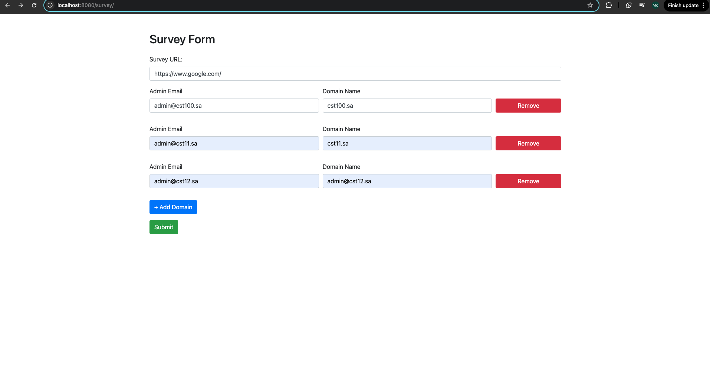
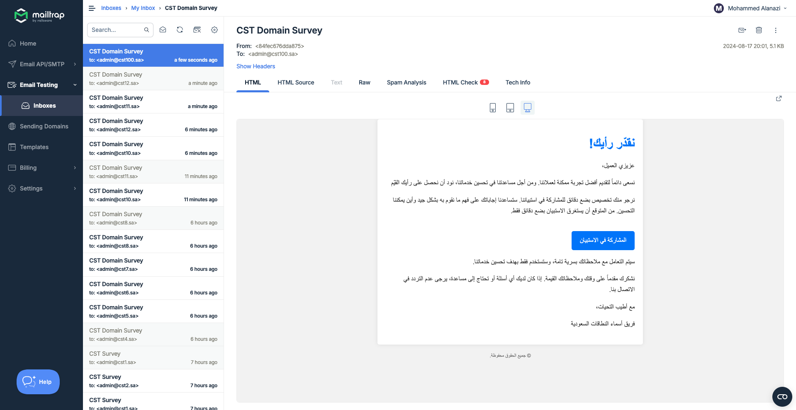

# Survey Automation System - README

## Overview

This Survey Automation System is designed to manage and conduct surveys with a simple MVC architecture

## Prerequisites

Before running the application, ensure that you have the following installed:

- Java 11
- MySQL database server

## Database Setup

To set up the database, follow these steps:

1. **Run the Init Script:**
    - Navigate to the `src/main/resources/db` folder.
    - Run the initialization script to create the database.

2. **Update Database Properties:**
    - Open the `application.dev.properties` file located in the `src/main/resources` folder.
    - Update the database connection properties with your own credentials:

      ```properties
      spring.datasource.username=root
      spring.datasource.password=AddYourOwnPassword
      ```

    - Ensure that the database specified in the properties file exists before running the application.

3. **Run the application:**
    - when you run the spring boot application hibernate will auto generate the tables

## Mail Service Configuration

This application uses Mailtrap for email services. To configure the mail service:

1. **Update Mail Service Properties:**
    - Open the `application.dev.properties` file located in the `src/main/resources` folder.
    - Update the Mailtrap credentials with your own:

      ```properties
      spring.mail.username=AddYourMailTrapUsername
      spring.mail.password=AddYourMailTrapPassword
      ```

2. **Mail Templates:**
    - A basic email template for survey notifications is included in the project. If additional or customized templates are required, they can be added to the `src/main/resources/templates` folder.

## How to use

- **Access the Survey Form:**
    - Once the application is running, navigate to `http://localhost:8080/survey/` in your browser to access and submit the survey form.


## Assumptions

This project was developed based on several assumptions:

- **Domain List Submission:**
    - The domain list could be submitted through an Excel sheet exported from another system.
    - The domain list could be submitted via another system, with this survey system potentially being part of a microservice architecture.
    - Simple MVC application where an admin manually enters the domains. (The current solution)

- **Email Job:**
    - The email job is scheduled to run every 1 minute for testing purposes. In a production environment, this interval should be adjusted.

## Out of Scope

The following topics were considered out of scope for this project:

- **Authentication and Validation:** Security mechanisms and input validation are not included.
- **Advanced UI Design:** The current implementation uses basic HTML. In a separate frontend application, we typically use UI component libraries such as PrimeNG or Angular Material.
- **Cross-Cutting Concerns via AOP:** Aspects such as logging or transaction management were not implemented using Aspect-Oriented Programming (AOP).
- **Advanced Design Patterns:** Patterns such as the Factory pattern, which could be used in the notification service, were not applied.
- **JPA Auditing:** The application does not implement JPA auditing for tracking changes to entities.

## Screenshots

Here are some screenshots of the application in action:

### Survey Form Page


### Example Email Notification


## Conclusion

This README provides an overview and essential instructions for setting up and running the Spring Boot application. Please ensure all configurations are correctly updated before deploying or testing the application in your environment. For any further questions or issues, refer to the documentation or contact the project maintainers.
